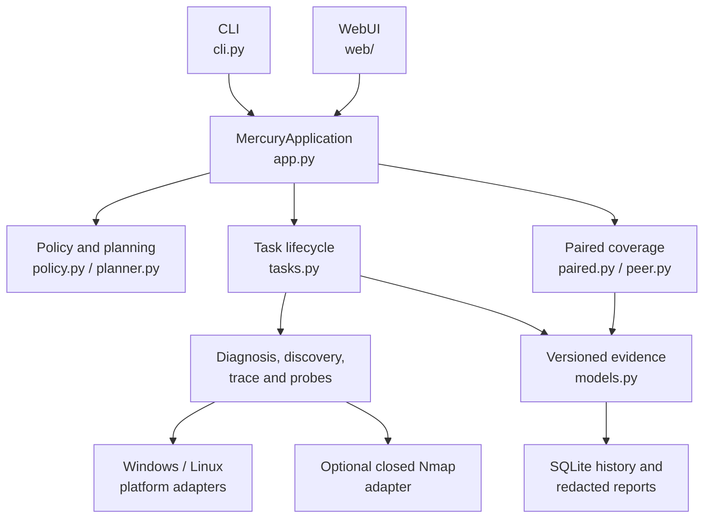
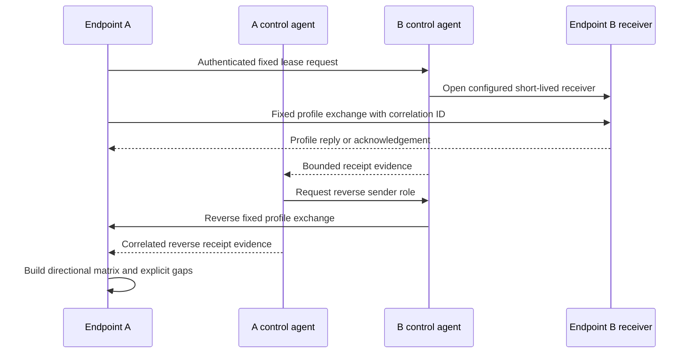

<!-- generated-by: gsd-doc-writer -->
# Architecture

[简体中文](zh-CN/ARCHITECTURE.md) · [README](../README.md) · [Evidence semantics](EVIDENCE-SEMANTICS.md)

## System overview

Mercury is a local-first Python application with a layered architecture. The CLI and WebUI translate operator input into typed requests, but both call the same `MercuryApplication` façade. The application compiles active requests into canonical, immutable plans, applies private-scope and resource policy before I/O, dispatches platform or protocol adapters, and returns one versioned `TaskResult` evidence model. A local SQLite store persists safe task records; an authenticated peer control channel coordinates only preconfigured two-endpoint profiles.

## Component diagram



Arrows mean “calls or supplies data to.” Presentation modules do not open scan sockets or start native scan subprocesses.

## Request and data flow

1. The CLI parser in `src/mercury/cli.py` or the HTTP handler in `src/mercury/web/__init__.py` validates input shape and constructs a typed request.
2. `MercuryApplication` in `src/mercury/app.py` enforces explicit authorization and routes the request to the relevant service. Both presenters use this same boundary.
3. `src/mercury/policy.py` canonicalizes private targets, grants, and DNS resolution snapshots. `src/mercury/planner.py` expands admitted work, checks exact aggregate costs, and binds steps, payload metadata, rates, concurrency, duration, scope, and ceilings into an immutable digest-bearing plan before I/O.
4. `TaskService` and `TaskContext` in `src/mercury/tasks.py` enforce admission, attempt-start rate, concurrency, cancellation, accounting, terminal evidence, and output ceilings while a runner executes only admitted step IDs.
5. Protocol runners in `src/mercury/probes.py`, discovery and mapping in `src/mercury/discovery.py`, route tracing in `src/mercury/trace.py`, or paired execution in `src/mercury/paired.py` gather typed observations. Native platform commands go through bounded adapters in `src/mercury/platform/`; optional Nmap receives only a validated plan through `src/mercury/nmap_adapter.py`.
6. Results become `Observation`, `Capability`, `Conclusion`, and `TaskResult` objects from `src/mercury/models.py`. CLI rendering, Web JSON, history, comparison, and reports consume these objects without reinterpreting network behavior.
7. `src/mercury/history.py` persists secret-free records in SQLite. `src/mercury/reports.py` applies default identifier/payload redaction and unconditional credential filtering to exports.

### Paired coverage flow



Non-loopback peer control requires the configured TLS certificate/key/CA, token, certificate pin, fixed peer addresses, replay checks, and closed operation handlers. Receiver leases can only select profiles and ports already present in the local administrator-provisioned configuration. They cannot carry an arbitrary third-party destination.

## Trust boundaries and invariants

### Active target policy

`src/mercury/policy.py` is the canonical target boundary. Supported active destinations are loopback, RFC1918 IPv4, RFC6598 shared IPv4, IPv6 ULA, or scoped IPv6 link-local where the operation supports that address form. Public, documentation, multicast, unspecified, and broadcast targets fail before active I/O. Hostnames are resolved for planning and rechecked before connection; every address must remain private and inside the declared scope. The multi-range mapping request deliberately narrows this policy to loopback and RFC1918 IPv4 CIDRs.

Non-loopback active work also requires explicit operator attestation. Private addressing is not treated as proof of authority.

### Immutable budgets

`BudgetLimits` in `src/mercury/planner.py` covers hosts, ports, attempts, generated datagrams, logical packets, application bytes, global and per-target attempt-start rates, concurrency, duration, events, and output bytes. A plan reserves its aggregate work before execution. Requested mapping duration `0` means no additional operator-selected cutoff and resolves to the configured finite duration ceiling.

The accounting model counts Mercury's logical operations and application payloads. It does not claim exact on-wire byte totals or kernel retransmission counts.

### Listener and peer security

The WebUI defaults to loopback. A non-loopback bind requires TLS and a token, and the HTTP layer also enforces Host validation, same-origin mutations, a SameSite session cookie, a CSRF header, a content security policy, and bounded request bodies.

Peer control is separate from Web mode. Non-loopback peers use mTLS, token authentication, certificate pinning, bounded frames, timestamp/replay protection, fixed peer addresses, and a closed operation set. The `unsafe_development` override is loopback-only.

### Persistence boundary

History projection excludes configuration paths and rejects secret-key fields and credential-like material before SQLite persistence. Reports redact hostnames, addresses, MAC addresses, and payload data by default. An explicit local export can retain those identifiers, but never credentials, tokens, or private keys.

## Key abstractions

| Abstraction | Location | Responsibility |
| --- | --- | --- |
| `MercuryApplication` | `src/mercury/app.py` | Shared service façade for CLI and WebUI |
| `Target`, `ScopeGrant`, `ResolutionSnapshot` | `src/mercury/policy.py` | Canonical private targets, authorization containment, and DNS snapshots |
| `InternalMappingRequest` | `src/mercury/planner.py` | Typed multi-CIDR mapping input with requested rate, concurrency, and duration |
| `BudgetLimits`, `PlanPreview`, `ProbePlan` | `src/mercury/planner.py` | Exact work accounting, immutable preview, and authorized execution plan |
| `TaskService`, `TaskContext` | `src/mercury/tasks.py` | Lifecycle, admission, cancellation, runtime accounting, and terminal results |
| `Observation`, `Capability`, `Conclusion`, `TaskResult` | `src/mercury/models.py` | Versioned evidence and result contracts |
| `CoverageAssessmentRequest`, `CoverageMatrixRow` | `src/mercury/paired.py` | Closed two-endpoint request and directional matrix row |
| `CoverageReceipt` | `src/mercury/models.py` | Correlation-bound peer arrival metadata without retaining raw test tags |
| `PeerConfig`, `PeerAgent`, `PeerClient` | `src/mercury/peer.py` | Administrator-provisioned peer trust and bounded control transport |
| `NativeNmapResult`, `NativePortState` | `src/mercury/nmap_adapter.py` | Bounded native evidence from a plan-derived Nmap invocation |
| `HistoryStore` | `src/mercury/history.py` | Local SQLite lifecycle and result persistence |

## Directory structure

```text
src/mercury/
├── app.py                 shared application façade
├── cli.py                 argparse presentation and exit codes
├── models.py              versioned evidence contracts
├── policy.py              private-scope and authorization policy
├── planner.py             immutable plans, estimates, and budgets
├── tasks.py               execution lifecycle and accounting
├── probes.py              protocol-specific probe adapters
├── diagnosis.py           layered endpoint diagnosis
├── discovery.py           passive discovery and private mapping
├── trace.py               bounded native route evidence
├── paired.py              paired senders, receivers, and coverage matrix
├── peer.py                authenticated peer control
├── nmap_adapter.py        closed optional native Nmap integration
├── history.py             SQLite persistence and secret rejection
├── reports.py             comparison and redacted exports
├── platform/              Windows, Linux, and common native adapters
└── web/                   standard-library HTTP server and static UI
tests/                     unittest suite, fakes, and loopback fixtures
docs/                      English project documentation
docs/zh-CN/                equivalent Simplified Chinese documentation
```

The organization keeps trust-boundary policy and evidence contracts independent of presentation. Feature runners remain small modules around standard-library or platform capabilities, while the application façade and task engine provide the shared control path required by both CLI and WebUI.

## Platform and dependency strategy

Mercury supports CPython 3.11+ and uses `psutil` as its only runtime dependency. Network execution, TLS, HTTP serving, concurrency, persistence, serialization, and resource loading use Python's standard library. Platform-specific collection is isolated under `src/mercury/platform/`. Nmap is an optional installed executable, not a Python dependency, and is invoked only through the closed adapter.

## Architectural limitations

- Windows and Ubuntu are the v1 release targets; other systems report unsupported capabilities where possible.
- Active discovery and multi-range mapping are IPv4-only in v1, although other selected operations support private IPv6 forms.
- ARP and IPv6 ND are same-link observations, not cross-subnet path evidence.
- ICMP peer arrival correlation depends on a platform observer capability; otherwise the matrix exposes the gap.
- The finite coverage matrix can identify candidate carriers and profile-specific direct negatives. It cannot establish that every possible tunnel, payload mutation, or protocol state sequence is absent.
