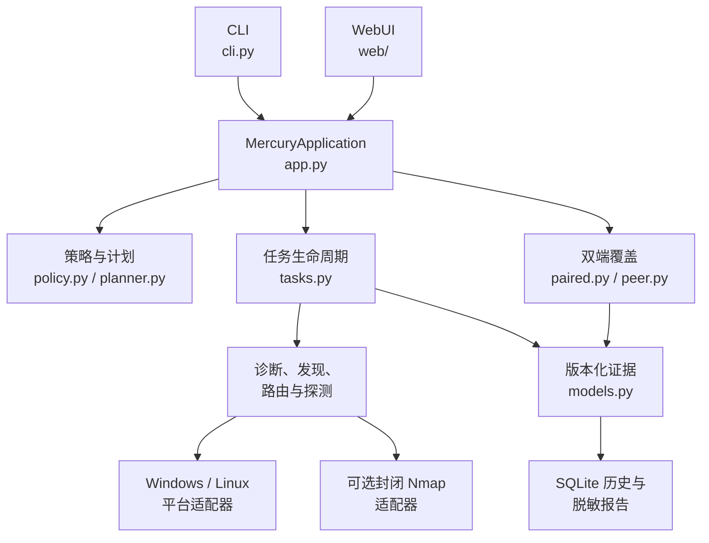
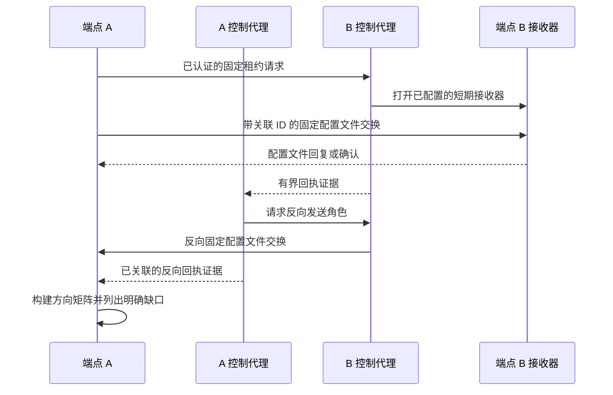

<!-- generated-by: gsd-doc-writer -->
# 架构

[English](../ARCHITECTURE.md) · [README](../../README.zh-CN.md) · [证据语义](EVIDENCE-SEMANTICS.md)

## 系统概览

Mercury 是一款采用分层架构的本地优先 Python 应用。CLI 与 WebUI 把操作员输入转换为强类型请求，但两者都调用同一个 `MercuryApplication` 外观。应用在 I/O 前把主动请求编译为规范、不可变的计划，应用私有范围和资源策略，分派平台或协议适配器，并返回同一版本化 `TaskResult` 证据模型。本地 SQLite 存储安全的任务记录；经过认证的对端控制通道只协调预配置的双端配置文件。

## 组件图



箭头表示“调用或向其提供数据”。表现层模块不会打开扫描套接字，也不会启动原生扫描子进程。

## 请求与数据流

1. `src/mercury/cli.py` 中的 CLI 解析器或 `src/mercury/web/__init__.py` 中的 HTTP 处理器校验输入形状并构造强类型请求。
2. `src/mercury/app.py` 中的 `MercuryApplication` 强制执行显式授权并把请求路由到对应服务。两个表现层共用该边界。
3. `src/mercury/policy.py` 规范化私有目标、授权范围和 DNS 解析快照。`src/mercury/planner.py` 展开已接纳任务、检查精确汇总成本，并在 I/O 前将步骤、载荷元数据、速率、并发、时长、范围和上限绑定到带摘要的不可变计划中。
4. `src/mercury/tasks.py` 中的 `TaskService` 与 `TaskContext` 在运行器只执行已接纳步骤 ID 的同时，强制执行准入、尝试启动速率、并发、取消、计量、终止证据和输出上限。
5. `src/mercury/probes.py` 中的协议运行器、`src/mercury/discovery.py` 中的发现与测绘、`src/mercury/trace.py` 中的路由跟踪，或 `src/mercury/paired.py` 中的双端执行会采集强类型观测。原生平台命令通过 `src/mercury/platform/` 中的有界适配器运行；可选 Nmap 只能经 `src/mercury/nmap_adapter.py` 接收已验证计划。
6. 结果成为 `src/mercury/models.py` 中的 `Observation`、`Capability`、`Conclusion` 与 `TaskResult` 对象。CLI 渲染、Web JSON、历史、比较和报告直接消费这些对象，不重新解释网络行为。
7. `src/mercury/history.py` 将无秘密记录持久化到 SQLite。`src/mercury/reports.py` 对导出应用默认标识符/载荷脱敏和无条件凭据过滤。

### 双端覆盖流程



非环回对端控制需要已配置的 TLS 证书/密钥/CA、令牌、证书指纹、固定对端地址、重放检查和封闭操作处理器。接收租约只能选择本机管理员配置中已存在的配置文件和端口，不能携带任意第三方目标。

## 信任边界与不变量

### 主动目标策略

`src/mercury/policy.py` 是规范目标边界。支持的主动目标是环回地址、RFC1918 IPv4、RFC6598 共享 IPv4、IPv6 ULA，或在操作支持相应地址形式时使用带作用域的 IPv6 链路本地地址。公网、文档专用、多播、未指定和广播目标会在主动 I/O 前失败。主机名在规划时解析，并在连接前复核；所有地址都必须保持私有且位于声明范围内。多范围测绘请求有意将该策略收窄为环回与 RFC1918 IPv4 CIDR。

非环回主动任务还需要操作员显式授权声明。私有地址本身不被视为权限证明。

### 不可变预算

`src/mercury/planner.py` 中的 `BudgetLimits` 覆盖主机、端口、尝试、生成的数据报、逻辑报文、应用字节、全局和逐目标尝试启动速率、并发、时长、事件与输出字节。计划在执行前预留其汇总任务量。测绘请求中的时长 `0` 表示不增加操作员指定的截止时间，最终会采用已配置的有限时长上限。

计量模型统计 Mercury 的逻辑操作和应用载荷，不声称获得精确线速字节总数或内核重传次数。

### 监听器与对端安全

WebUI 默认仅监听环回地址。非环回绑定需要 TLS 和令牌；HTTP 层还强制校验 Host、同源变更请求、SameSite 会话 Cookie、CSRF 头、内容安全策略以及有界请求体。

对端控制与 Web 模式分离。非环回对端使用 mTLS、令牌认证、证书指纹、有界帧、时间戳/重放保护、固定对端地址和封闭操作集合。`unsafe_development` 覆盖仅限环回。

### 持久化边界

历史投影排除配置路径，并在写入 SQLite 前拒绝秘密键字段和类似凭据的材料。报告默认脱敏主机名、地址、MAC 地址和载荷数据。显式本地导出可以保留这些标识符，但绝不会保留凭据、令牌或私钥。

## 关键抽象

| 抽象 | 位置 | 职责 |
| --- | --- | --- |
| `MercuryApplication` | `src/mercury/app.py` | CLI 与 WebUI 共用的服务外观 |
| `Target`、`ScopeGrant`、`ResolutionSnapshot` | `src/mercury/policy.py` | 规范私有目标、授权包含关系与 DNS 快照 |
| `InternalMappingRequest` | `src/mercury/planner.py` | 包含所请求速率、并发和时长的强类型多 CIDR 测绘输入 |
| `BudgetLimits`、`PlanPreview`、`ProbePlan` | `src/mercury/planner.py` | 精确任务计量、不可变预览与授权执行计划 |
| `TaskService`、`TaskContext` | `src/mercury/tasks.py` | 生命周期、准入、取消、运行时计量与终止结果 |
| `Observation`、`Capability`、`Conclusion`、`TaskResult` | `src/mercury/models.py` | 版本化证据与结果契约 |
| `CoverageAssessmentRequest`、`CoverageMatrixRow` | `src/mercury/paired.py` | 封闭双端请求与方向矩阵行 |
| `CoverageReceipt` | `src/mercury/models.py` | 关联绑定的对端到达元数据，不保留原始测试标签 |
| `PeerConfig`、`PeerAgent`、`PeerClient` | `src/mercury/peer.py` | 管理员预置的对端信任与有界控制传输 |
| `NativeNmapResult`、`NativePortState` | `src/mercury/nmap_adapter.py` | 从计划派生的 Nmap 调用获取有界原生证据 |
| `HistoryStore` | `src/mercury/history.py` | 本地 SQLite 生命周期与结果持久化 |

## 目录结构

```text
src/mercury/
├── app.py                 共用应用外观
├── cli.py                 argparse 表现层与退出码
├── models.py              版本化证据契约
├── policy.py              私有范围与授权策略
├── planner.py             不可变计划、估算与预算
├── tasks.py               执行生命周期与计量
├── probes.py              协议专用探测适配器
├── diagnosis.py           分层端点诊断
├── discovery.py           被动发现与私有测绘
├── trace.py               有界原生路由证据
├── paired.py              双端发送器、接收器与覆盖矩阵
├── peer.py                已认证对端控制
├── nmap_adapter.py        封闭的可选原生 Nmap 集成
├── history.py             SQLite 持久化与秘密拒绝
├── reports.py             比较与脱敏导出
├── platform/              Windows、Linux 与共用原生适配器
└── web/                   标准库 HTTP 服务器与静态 UI
tests/                     unittest 套件、伪实现与环回样例
docs/                      英文项目文档
docs/zh-CN/                等价的简体中文文档
```

这种组织方式使信任边界策略和证据契约独立于表现层。功能运行器围绕标准库或平台能力保持为小模块，而应用外观与任务引擎为 CLI 和 WebUI 提供所需的共用控制路径。

## 平台与依赖策略

Mercury 支持 CPython 3.11+，唯一运行时依赖为 `psutil`。网络执行、TLS、HTTP 服务、并发、持久化、序列化和资源加载均使用 Python 标准库。平台专用采集隔离在 `src/mercury/platform/` 下。Nmap 是可选的已安装可执行文件，不是 Python 依赖，并且只能通过封闭适配器调用。

## 架构限制

- Windows 和 Ubuntu 是 v1 发布目标；其他系统会在可能时报告不支持的能力。
- v1 的主动发现与多范围测绘仅支持 IPv4，但其他选定操作支持私有 IPv6 形式。
- ARP 与 IPv6 ND 是同链路观测，不是跨子网路径证据。
- ICMP 对端到达关联依赖平台观察器能力；否则矩阵会暴露该缺口。
- 有限覆盖矩阵可以识别候选承载通道和配置文件特定的直接否定结果，但无法证明所有可能的隧道、载荷变体或协议状态序列均不存在。
